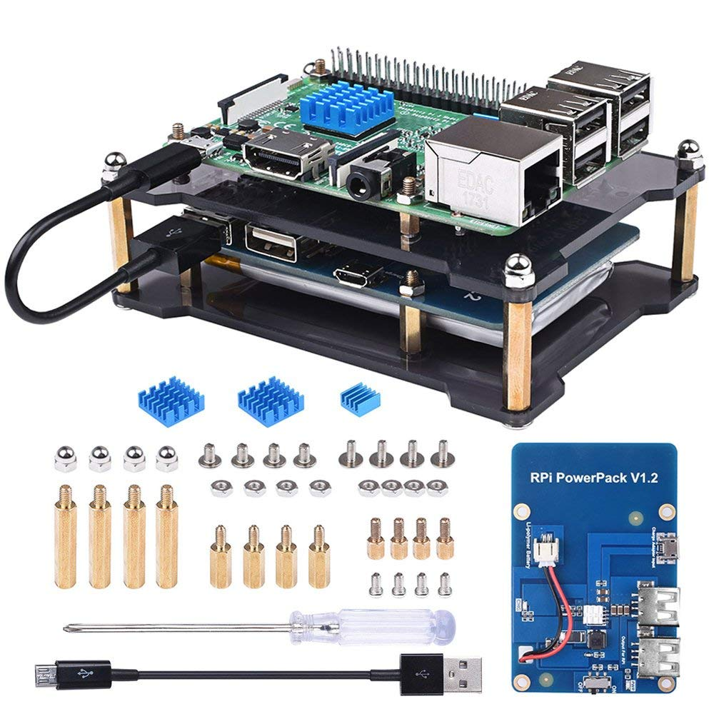

# raspberry-pi-notebook

## Active

Test:

Inline-style: 

Installing BlueZ for BLE support [link](https://www.youtube.com/watch?v=5fQR2PHMDWE)

## Future

Off-topic Graph Database [link](https://neo4j.com/whitepapers/master-data-graph-databases/?ref=solutions-2)
